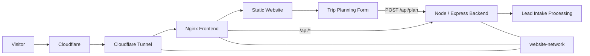

# Voyages By Dave

Source repository for **[Voyages By Dave](https://voyagesbydave.ca)**, a Canada-focused travel planning website based in British Columbia's Fraser Valley.

The site helps Canadians research and plan travel within Canada, with particular emphasis on trips where routing, accessibility, transportation, multiple generations, or other logistical details require more thought than a simple booking.

## Website

**Production:** https://voyagesbydave.ca

Primary content includes:

* British Columbia and Western Canada
* Canadian Rockies
* Canada by rail
* Canadian road trips
* Atlantic Canada
* Ontario and Quebec
* Northern Canada
* Canadian cruises
* Canada-only itineraries
* Accessible travel
* Multigenerational travel
* Adventure and diving
* Trip-planning information and intake

## Architecture

The site uses a small self-hosted Docker stack.



### Services

The Docker Compose stack contains three services:

**`website-frontend`**

* Built from `frontend/`
* Uses `nginx:alpine`
* Serves the static HTML, CSS, JavaScript and site assets
* Proxies `/api/*` requests to the backend
* Exposes port 80 only inside the Docker network

**`website-backend`**

* Built from `backend/`
* Runs Node.js 20 and Express
* Listens on port 4000 inside the Docker network
* Provides the trip-planning API and health endpoint

**`website-tunnel`**

* Uses the official Cloudflare `cloudflared` image
* Connects the site to Cloudflare Tunnel
* No application ports need to be published directly to the host

All services use the external Docker network:

```text
website-network
```

## Request Flow

Normal website traffic follows:

```text
Browser
  → Cloudflare
  → Cloudflare Tunnel
  → Nginx
  → Static website
```

API traffic follows:

```text
Browser
  → Cloudflare
  → Cloudflare Tunnel
  → Nginx
  → /api/*
  → Express backend
```

## Repository Structure

```text
website-2027/
├── backend/
│   ├── Dockerfile
│   ├── package.json
│   └── server.js
│
├── frontend/
│   ├── Dockerfile
│   ├── nginx.conf
│   ├── config.js
│   ├── site.js
│   ├── style.css
│   ├── sitemap.xml
│   ├── index.html
│   ├── about/
│   ├── accessible-travel-canada/
│   ├── adventure-canada/
│   ├── atlantic-canada/
│   ├── british-columbia/
│   ├── canada/
│   ├── canada-by-rail/
│   ├── canada-only-travel/
│   ├── canadian-cruises/
│   ├── canadian-road-trips/
│   ├── canadian-rockies/
│   ├── faq/
│   ├── how-i-work/
│   ├── multigenerational-canada/
│   ├── northern-canada/
│   ├── ontario-quebec/
│   └── plan/
│
├── .env.example
├── docker-compose.yml
└── README.md
```

The directory listing above is intentionally simplified. Individual page directories contain the `index.html` files used for clean URLs.

## Frontend

The frontend is deliberately simple and does not require a JavaScript framework or build process.

It consists primarily of:

* semantic HTML
* shared CSS
* lightweight vanilla JavaScript
* Nginx
* shared runtime configuration in `config.js`

This keeps deployment straightforward and allows individual destination and trip-type pages to remain independently crawlable.

### Shared Configuration

Common site values are stored in:

```text
frontend/config.js
```

This includes values such as:

* brand name
* tagline
* website URL
* telephone number
* email address
* location
* planning fee
* primary calls to action
* API endpoint
* copyright year

Elements using `data-config` attributes are populated from these values by `site.js`.

## Navigation and Client-Side Behaviour

`frontend/site.js` provides lightweight shared functionality including:

* mobile navigation
* expandable mobile submenus
* active-page navigation state
* shared configuration population
* trip-form URL prefilling
* asynchronous trip-form submission
* form success and error messages

There is no client-side application framework.

## Trip Planning Intake

The primary client intake form is located at:

```text
/plan/
```

The form can collect:

* contact information
* destination
* approximate dates
* date flexibility
* departure point
* number and composition of travellers
* trip type
* Canada-only requirements
* mobility and accessibility requirements
* current planning stage
* planning questions or challenges
* an optional planning document or image

The browser submits the form as `multipart/form-data` to:

```text
POST /api/plan
```

The backend accepts an optional uploaded document with a maximum size of 10 MB.

### Current Intake Behaviour

The current backend validates receipt of the form and writes the intake information to the application log.

It does **not yet provide persistent lead storage or email/CRM delivery**.

The uploaded file is processed in memory; the current log entry records file metadata rather than persisting the uploaded document.

Future lead-processing functionality can be added behind `/api/plan` without changing the public form interface.

## API

### Health Check

```http
GET /api/health
```

Example response:

```json
{
  "status": "ok",
  "service": "voyages-by-dave-backend"
}
```

This endpoint is also used by the Docker health check.

### Trip Intake

```http
POST /api/plan
```

Accepts the trip-planning form and an optional document upload.

## SEO

The site uses server-rendered static HTML so primary content is available without client-side rendering.

Pages include elements such as:

* `lang="en-CA"`
* canonical URLs
* page descriptions
* Open Graph images
* sitemap
* structured data on the homepage

The sitemap is available at:

https://voyagesbydave.ca/sitemap.xml

When adding, removing or substantially updating pages, review `frontend/sitemap.xml` as part of the change.

## Local / Self-Hosted Deployment

### Requirements

* Docker
* Docker Compose
* a Cloudflare Tunnel
* an existing Docker network named `website-network`

### 1. Clone the repository

```bash
git clone https://github.com/drintoul/website-2027.git
cd website-2027
```

### 2. Create the Docker network

If it does not already exist:

```bash
docker network create website-network
```

### 3. Create the environment file

Copy the example:

```bash
cp .env.example .env
```

Add the Cloudflare Tunnel token:

```text
CLOUDFLARE_TUNNEL_TOKEN=<your-token>
```

Never commit `.env` or a real tunnel token to Git.

### 4. Build and start

```bash
docker compose up -d --build
```

### 5. Check status

```bash
docker compose ps
```

### 6. Check backend health

Because the backend is not published directly to the host, the health check can be run inside the container:

```bash
docker compose exec website-backend \
  wget -qO- http://localhost:4000/api/health
```

Or, once the Cloudflare route is configured:

```bash
curl https://voyagesbydave.ca/api/health
```

Expected response:

```json
{"status":"ok","service":"voyages-by-dave-backend"}
```

## Updating the Site

Most content changes require editing the appropriate file under `frontend/`.

For example:

```text
frontend/canadian-rockies/index.html
frontend/accessible-travel-canada/index.html
frontend/about/index.html
```

After making changes:

```bash
docker compose up -d --build website-frontend
```

For backend changes:

```bash
docker compose up -d --build website-backend
```

To rebuild the entire stack:

```bash
docker compose up -d --build
```

## Logs

Frontend:

```bash
docker compose logs -f website-frontend
```

Backend:

```bash
docker compose logs -f website-backend
```

Cloudflare Tunnel:

```bash
docker compose logs -f website-tunnel
```

All services:

```bash
docker compose logs -f
```

## Security

Do not commit secrets to this repository.

In particular:

```text
.env
```

must remain local and should be excluded through `.gitignore`.

Only `.env.example` should be committed, using placeholder values.

The application containers do not publish their HTTP ports directly to the Docker host. Public access is provided through Cloudflare Tunnel.

If a tunnel token or other credential is accidentally committed, rotate the credential immediately and remove it from Git history rather than simply deleting it in a later commit.

## Design Philosophy

The technical stack is intentionally modest.

The website is primarily a content and client-acquisition site, so the architecture prioritizes:

* fast static page delivery
* straightforward maintenance
* clean URLs
* search-engine accessibility
* minimal client-side dependencies
* self-hosted deployment
* a small backend surface for functions that actually require server-side processing

The goal is not to turn a travel website into a software platform. The technology exists to support the travel-planning business.

---

**Voyages By Dave**
Canadian travel planning
https://voyagesbydave.ca
